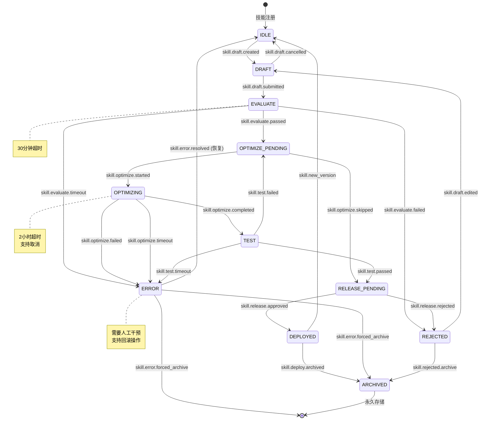
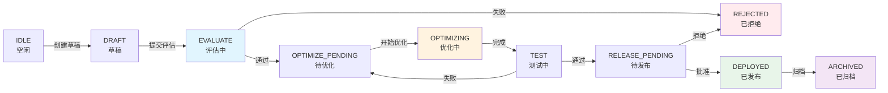

# EvoMap 进化流水线状态机图

> 版本: 1.0.0  
> 描述: EvoMap技能自动进化流水线的状态机详细说明

---

## 1. 状态机概览

```
┌───────────────────────────────────────────────────────────────────────────────────────────┐
│                                    技能生命周期状态机                                      │
│                                                                                           │
│   ┌─────────┐                                                                              │
│   │  IDLE   │ ◀─────────────────────────────────────────────────────────────────────┐     │
│   │ (空闲)  │                                                                        │     │
│   └────┬────┘                                                                        │     │
│        │ skill.draft.created                                                          │     │
│        │ (Git提交/手动触发)                                                           │     │
│        ▼                                                                             │     │
│   ┌─────────┐                                                                        │     │
│   │  DRAFT  │                                                                        │     │
│   │ (草稿)  │                                                                        │     │
│   └────┬────┘                                                                        │     │
│        │ skill.draft.submitted                                                        │     │
│        │ (提交评估)                                                                   │     │
│        ▼                                                                             │     │
│   ┌─────────┐     评估失败     ┌──────────┐                                           │     │
│   │EVALUATE │ ───────────────▶ │ REJECTED │ ─────────────────────────────────────────▶│     │
│   │ (评估中)│                  │ (已拒绝) │                                          │     │
│   └────┬────┘                  └──────────┘                                          │     │
│        │                                                                             │     │
│        │ 评估通过且需要优化                                                          │     │
│        ▼                                                                             │     │
│   ┌─────────────────┐                                                                │     │
│   │ OPTIMIZE_PENDING│                                                                │     │
│   │   (待优化)      │                                                                │     │
│   └────────┬────────┘                                                                │     │
│            │ skill.optimize.started                                                  │     │
│            ▼                                                                         │     │
│   ┌─────────────────┐    优化失败    ┌──────────┐                                    │     │
│   │   OPTIMIZING    │ ─────────────▶ │  ERROR   │ ───────────────────────────────────▶│     │
│   │   (优化中)      │                │ (错误)   │                                    │     │
│   └────────┬────────┘                └──────────┘                                    │     │
│            │                                                                         │     │
│            │ 优化完成                                                                │     │
│            ▼                                                                         │     │
│   ┌─────────────────┐    测试失败    ┌──────────┐                                    │     │
│   │      TEST       │ ─────────────▶ │ OPTIMIZE │ ───────────────────────────────────┤     │
│   │    (测试中)     │                │ _PENDING │ ◀──────────────────────────────────┘     │
│   └────────┬────────┘                └──────────┘ (重新进入优化)                          │
│            │                                                                         │     │
│            │ 测试通过                                                                │     │
│            ▼                                                                         │     │
│   ┌─────────────────┐                                                                │     │
│   │ RELEASE_PENDING │                                                                │     │
│   │   (待发布)      │                                                                │     │
│   └────────┬────────┘                                                                │     │
│            │ skill.release.approved                                                  │     │
│            ▼                                                                         │     │
│   ┌─────────────────┐                                                                │     │
│   │    DEPLOYED     │ ──────────────────────────────────────────────────────────────▶│     │
│   │    (已发布)     │       skill.deploy.archived                                     │     │
│   └────────┬────────┘                                                                │     │
│            │                                                                         │     │
│            ▼                                                                         │     │
│   ┌─────────────────┐                                                                │     │
│   │    ARCHIVED     │                                                                │     │
│   │    (已归档)     │                                                                │     │
│   └─────────────────┘                                                                │     │
│                                                                                           │
└───────────────────────────────────────────────────────────────────────────────────────────┘
```

---

## 2. 状态详细说明

### 2.1 状态属性表

| 状态 | 状态码 | 描述 | 停留时限 | 允许的操作 |
|------|--------|------|----------|------------|
| **IDLE** | `idle` | 空闲状态，技能已注册但未开始进化 | 无限制 | 编辑、删除、启动评估 |
| **DRAFT** | `draft` | 草稿状态，有未评估的变更 | 7天 | 编辑、提交评估、取消 |
| **EVALUATE** | `evaluate` | 评估中，正在进行质量评估 | 30分钟 | 取消(仅管理员) |
| **REJECTED** | `rejected` | 已拒绝，评估未通过 | 无限制 | 重新编辑、重新提交、删除 |
| **OPTIMIZE_PENDING** | `optimize_pending` | 待优化，等待优化执行 | 3天 | 启动优化、跳过优化、取消 |
| **OPTIMIZING** | `optimizing` | 优化中，正在进行自动优化 | 2小时 | 取消(仅管理员) |
| **TEST** | `test` | 测试中，验证优化结果 | 1小时 | 查看日志、取消 |
| **RELEASE_PENDING** | `release_pending` | 待发布，等待最终发布 | 7天 | 批准发布、拒绝、回滚 |
| **DEPLOYED** | `deployed` | 已发布，技能已在生产环境 | 无限制 | 归档、创建新版本 |
| **ARCHIVED** | `archived` | 已归档，技能已退役 | 永久 | 恢复(特殊权限) |
| **ERROR** | `error` | 错误状态，需要人工干预 | 无限制 | 诊断、修复、回滚、强制归档 |

### 2.2 状态持续时间配置

```yaml
state_limits:
  draft:
    max_duration: "7d"           # 7天后自动清理
    warning_at: "5d"             # 5天时发送警告
  
  evaluate:
    max_duration: "30m"          # 30分钟超时
    warning_at: "20m"
  
  optimize_pending:
    max_duration: "3d"
    warning_at: "2d"
  
  optimizing:
    max_duration: "2h"           # 2小时超时
    warning_at: "1h30m"
  
  test:
    max_duration: "1h"
    warning_at: "45m"
  
  release_pending:
    max_duration: "7d"
    warning_at: "5d"
```

---

## 3. 状态转换触发器

### 3.1 触发器总览

```
┌─────────────────────────────────────────────────────────────────────────────┐
│                           状态转换触发器图                                   │
├─────────────────────────────────────────────────────────────────────────────┤
│                                                                             │
│   系统触发 (System)          用户触发 (Manual)          定时触发 (Scheduled)  │
│   ┌─────────────────┐       ┌─────────────────┐       ┌─────────────────┐  │
│   │ • Git Hook      │       │ • CLI命令       │       │ • 质量扫描      │  │
│   │ • Webhook       │       │ • Dashboard     │       │ • 依赖检查      │  │
│   │ • 事件监听      │       │ • API调用       │       │ • 安全审计      │  │
│   └─────────────────┘       └─────────────────┘       └─────────────────┘  │
│                                                                             │
└─────────────────────────────────────────────────────────────────────────────┘
```

### 3.2 详细触发器定义

| 触发器ID | 名称 | 源状态 | 目标状态 | 触发条件 | 执行者 | 优先级 |
|----------|------|--------|----------|----------|--------|--------|
| `skill.draft.created` | 创建草稿 | IDLE | DRAFT | Git push / 手动触发 | 系统 | 高 |
| `skill.draft.submitted` | 提交评估 | DRAFT | EVALUATE | 用户点击"开始评估" | 系统 | 高 |
| `skill.draft.cancelled` | 取消草稿 | DRAFT | IDLE | 用户放弃当前变更 | 用户 | 中 |
| `skill.evaluate.passed` | 评估通过 | EVALUATE | OPTIMIZE_PENDING | 总分≥阈值且无严重问题 | 系统 | 高 |
| `skill.evaluate.failed` | 评估失败 | EVALUATE | REJECTED | 总分<阈值或有严重问题 | 系统 | 高 |
| `skill.evaluate.timeout` | 评估超时 | EVALUATE | ERROR | 超过30分钟 | 系统 | 高 |
| `skill.optimize.started` | 开始优化 | OPTIMIZE_PENDING | OPTIMIZING | 用户批准或自动触发 | 系统/用户 | 中 |
| `skill.optimize.skipped` | 跳过优化 | OPTIMIZE_PENDING | RELEASE_PENDING | 用户选择跳过 | 用户 | 中 |
| `skill.optimize.completed` | 优化完成 | OPTIMIZING | TEST | 所有操作成功 | 系统 | 高 |
| `skill.optimize.failed` | 优化失败 | OPTIMIZING | ERROR | 关键操作失败 | 系统 | 高 |
| `skill.optimize.timeout` | 优化超时 | OPTIMIZING | ERROR | 超过2小时 | 系统 | 高 |
| `skill.test.passed` | 测试通过 | TEST | RELEASE_PENDING | 所有测试通过 | 系统 | 高 |
| `skill.test.failed` | 测试失败 | TEST | OPTIMIZE_PENDING | 测试未通过 | 系统 | 高 |
| `skill.release.approved` | 批准发布 | RELEASE_PENDING | DEPLOYED | 用户确认发布 | 用户 | 高 |
| `skill.release.rejected` | 拒绝发布 | RELEASE_PENDING | REJECTED | 用户拒绝发布 | 用户 | 高 |
| `skill.deploy.archived` | 归档技能 | DEPLOYED | ARCHIVED | 技能退役/淘汰 | 系统/用户 | 低 |
| `skill.error.resolved` | 错误解决 | ERROR | 上一状态 | 人工修复后恢复 | 用户 | 中 |
| `skill.error.rollback` | 错误回滚 | ERROR | 检查点状态 | 回滚到上一检查点 | 系统/用户 | 高 |
| `skill.error.forced_archive` | 强制归档 | ERROR | ARCHIVED | 废弃有问题的技能 | 管理员 | 低 |

---

## 4. 转换条件与守卫

### 4.1 条件守卫规则

```
┌─────────────────────────────────────────────────────────────────────────────┐
│                          状态转换守卫 (Guards)                               │
├─────────────────────────────────────────────────────────────────────────────┤
│                                                                             │
│  EVALUATE ──▶ OPTIMIZE_PENDING                                              │
│  ┌──────────────────────────────────────────────────────────────────────┐  │
│  │ guards:                                                               │  │
│  │   - overall_score >= 70                                               │  │
│  │   - critical_issues == 0                                              │  │
│  │   - security_issues.high == 0                                         │  │
│  └──────────────────────────────────────────────────────────────────────┘  │
│                                                                             │
│  EVALUATE ──▶ REJECTED                                                      │
│  ┌──────────────────────────────────────────────────────────────────────┐  │
│  │ guards:                                                               │  │
│  │   - overall_score < 70 OR critical_issues > 0                         │  │
│  └──────────────────────────────────────────────────────────────────────┘  │
│                                                                             │
│  OPTIMIZE_PENDING ──▶ OPTIMIZING                                            │
│  ┌──────────────────────────────────────────────────────────────────────┐  │
│  │ guards:                                                               │  │
│  │   - auto_optimize == true OR manual_approval == true                  │  │
│  │   - queue_position == 0 (轮到执行)                                    │  │
│  │   - resources.available == true                                       │  │
│  └──────────────────────────────────────────────────────────────────────┘  │
│                                                                             │
│  OPTIMIZING ──▶ TEST                                                        │
│  ┌──────────────────────────────────────────────────────────────────────┐  │
│  │ guards:                                                               │  │
│  │   - all_operations.success == true                                    │  │
│  │   - no_critical_errors == true                                        │  │
│  └──────────────────────────────────────────────────────────────────────┘  │
│                                                                             │
│  OPTIMIZING ──▶ ERROR                                                       │
│  ┌──────────────────────────────────────────────────────────────────────┐  │
│  │ guards:                                                               │  │
│  │   - critical_operation.failed == true                                 │  │
│  │   - rollback_failed == true                                           │  │
│  └──────────────────────────────────────────────────────────────────────┘  │
│                                                                             │
│  TEST ──▶ RELEASE_PENDING                                                   │
│  ┌──────────────────────────────────────────────────────────────────────┐  │
│  │ guards:                                                               │  │
│  │   - unit_tests.passed == true                                         │  │
│  │   - integration_tests.passed == true                                  │  │
│  │   - performance_regression < 5%                                       │  │
│  │   - security_scan.passed == true                                      │  │
│  └──────────────────────────────────────────────────────────────────────┘  │
│                                                                             │
│  RELEASE_PENDING ──▶ DEPLOYED                                               │
│  ┌──────────────────────────────────────────────────────────────────────┐  │
│  │ guards:                                                               │  │
│  │   - approval.received == true                                         │  │
│  │   - signature.verified == true                                        │  │
│  │   - backup.created == true                                            │  │
│  └──────────────────────────────────────────────────────────────────────┘  │
│                                                                             │
└─────────────────────────────────────────────────────────────────────────────┘
```

### 4.2 转换动作 (Actions)

每个状态转换可以伴随以下动作：

```yaml
actions:
  on_enter:         # 进入状态时
    - validate_state
    - log_transition
    - notify_observers
    - start_timers
    
  on_exit:          # 离开状态时
    - save_checkpoint
    - update_metrics
    - stop_timers
    
  on_transition:    # 转换过程中
    - execute_trigger
    - check_guards
    - run_side_effects
```

---

## 5. 错误状态处理

### 5.1 错误状态机

```
┌─────────────────────────────────────────────────────────────────────────────┐
│                           错误处理状态机                                     │
├─────────────────────────────────────────────────────────────────────────────┤
│                                                                             │
│                              ┌──────────┐                                   │
│                              │  *任意*   │                                   │
│                              │  状态    │                                   │
│                              └────┬─────┘                                   │
│                                   │ error.occurred                           │
│                                   ▼                                         │
│                           ┌──────────┐                                      │
│                           │  ERROR   │                                      │
│                           │ (错误)   │                                      │
│                           └────┬─────┘                                      │
│                                │                                            │
│            ┌───────────────────┼───────────────────┐                        │
│            │                   │                   │                        │
│            ▼                   ▼                   ▼                        │
│    ┌──────────┐        ┌──────────┐        ┌──────────┐                     │
│    │ RESOLVED │        │ ROLLED   │        │ ARCHIVED │                     │
│    │ 已解决   │        │ BACK     │        │ 已归档   │                     │
│    └──────────┘        └──────────┘        └──────────┘                     │
│                                                                             │
│    修复后恢复          回滚到检查点          废弃技能                        │
│                                                                             │
└─────────────────────────────────────────────────────────────────────────────┘
```

### 5.2 错误分类与处理策略

| 错误类型 | 错误码前缀 | 示例 | 处理策略 | 自动恢复 |
|----------|------------|------|----------|----------|
| **临时错误** | `TEM_` | 网络超时、服务不可用 | 重试3次，指数退避 | 是 |
| **逻辑错误** | `LOG_` | 语法错误、类型不匹配 | 标记失败，等待修复 | 否 |
| **资源错误** | `RES_` | 内存不足、磁盘满 | 清理资源，重新调度 | 是 |
| **配置错误** | `CFG_` | 缺少环境变量、配置无效 | 告警，等待人工配置 | 否 |
| **依赖错误** | `DEP_` | 依赖不存在、版本冲突 | 尝试自动修复，失败则告警 | 部分 |
| **权限错误** | `PER_` | 无写权限、令牌过期 | 告警，等待授权 | 否 |
| **超时错误** | `TMO_` | 操作超时 | 尝试回滚，标记失败 | 是 |
| **未知错误** | `UNK_` | 未分类错误 | 记录详细日志，等待调查 | 否 |

### 5.3 错误恢复流程

```
┌─────────────────────────────────────────────────────────────────────────────┐
│                         自动错误恢复流程                                     │
├─────────────────────────────────────────────────────────────────────────────┤
│                                                                             │
│  1. 错误检测                                                                │
│     ┌─────────────────────────────────────────────────────────────────┐    │
│     │ • 异常捕获                                                        │    │
│     │ • 返回码检查                                                      │    │
│     │ • 超时监控                                                        │    │
│     │ • 心跳检测                                                        │    │
│     └─────────────────────────────────────────────────────────────────┘    │
│                              │                                              │
│                              ▼                                              │
│  2. 错误分类                                                                │
│     ┌─────────────────────────────────────────────────────────────────┐    │
│     │ 根据错误码前缀分类:                                                │    │
│     │ • TEM_* → 临时错误 → 重试流程                                      │    │
│     │ • 其他 → 持久错误 → 回滚流程                                       │    │
│     └─────────────────────────────────────────────────────────────────┘    │
│                              │                                              │
│              ┌───────────────┴───────────────┐                              │
│              │                               │                              │
│              ▼                               ▼                              │
│  3a. 重试流程              3b. 回滚流程                                       │
│     ┌─────────────┐          ┌─────────────┐                                │
│     │ 重试次数 < N?│          │ 查找检查点   │                                │
│     └──────┬──────┘          └──────┬──────┘                                │
│            │                         │                                       │
│       是 ──┴── 否              存在 ──┴── 不存在                             │
│            │                         │                                       │
│            ▼                         ▼                                       │
│     ┌─────────────┐          ┌─────────────┐                                │
│     │ 指数退避    │          │ 执行回滚    │                                │
│     │ 等待重试    │          │ 恢复状态    │                                │
│     └─────────────┘          └─────────────┘                                │
│                                                                             │
└─────────────────────────────────────────────────────────────────────────────┘
```

---

## 6. 回滚机制

### 6.1 回滚点定义

```yaml
# 自动检查点配置
checkpoints:
  auto_create:
    - on_state_enter: ["EVALUATE", "OPTIMIZING", "TEST", "DEPLOYED"]
    - before_operation: ["destructive", "git_push", "release"]
    - on_timeout: 1800  # 每30分钟
  
  retention:
    max_count: 10       # 最多保留10个检查点
    max_age: "7d"       # 保留7天
    auto_cleanup: true
```

### 6.2 回滚范围

| 回滚类型 | 描述 | 触发条件 | 恢复内容 |
|----------|------|----------|----------|
| **操作回滚** | 单个操作失败 | 优化操作失败 | 该操作前的状态 |
| **阶段回滚** | 整个阶段失败 | 测试失败 | 阶段开始前的状态 |
| **进化回滚** | 整个进化失败 | 严重错误 | 进化开始前的状态 |
| **紧急回滚** | 生产问题 | 发布后发现问题 | 上一稳定版本 |

### 6.3 回滚状态转换

```
┌─────────────────────────────────────────────────────────────────────────────┐
│                          回滚状态转换                                        │
├─────────────────────────────────────────────────────────────────────────────┤
│                                                                             │
│   任意状态                                                                  │
│      │                                                                      │
│      │ rollback.requested                                                   │
│      ▼                                                                      │
│   ┌──────────────┐                                                          │
│   │ ROLLING_BACK │                                                          │
│   │  (回滚中)    │                                                          │
│   └──────┬───────┘                                                          │
│          │                                                                  │
│     ┌────┴────┐                                                             │
│     │         │                                                             │
│     ▼         ▼                                                             │
│  ┌───────┐  ┌────────┐                                                      │
│  │ 原状态 │  │ ERROR  │                                                      │
│  └───────┘  └────────┘                                                      │
│   回滚成功   回滚失败                                                        │
│                                                                             │
└─────────────────────────────────────────────────────────────────────────────┘
```

---

## 7. 状态历史与审计

### 7.1 状态历史记录格式

```typescript
interface StateTransition {
  transitionId: string;           // 转换ID
  skillId: string;                // 技能ID
  evolutionId: string;            // 进化任务ID
  
  fromState: SkillStatus;         // 源状态
  toState: SkillStatus;           // 目标状态
  
  trigger: string;                // 触发器ID
  triggeredBy: string;            // 触发者
  
  timestamp: number;              // 转换时间
  duration: number;               // 在源状态停留时间(ms)
  
  context: {
    gitCommit?: string;           // 关联的Git提交
    evaluationId?: string;        // 关联的评估ID
    executionId?: string;         // 关联的执行ID
    errorCode?: string;           // 错误码(如果是错误转换)
    metadata: Record<string, any>;
  };
}
```

### 7.2 状态统计指标

```yaml
metrics:
  # 转换频率
  transitions_per_day: counter   # 每日状态转换次数
  
  # 停留时间
  avg_time_in_state: histogram   # 各状态平均停留时间
  max_time_in_state: gauge       # 各状态最大停留时间
  
  # 成功率
  evaluate_pass_rate: gauge      # 评估通过率
  optimize_success_rate: gauge   # 优化成功率
  test_pass_rate: gauge          # 测试通过率
  
  # 错误率
  error_rate: gauge              # 错误发生率
  rollback_rate: gauge           # 回滚率
  
  # 吞吐量
  evolutions_per_hour: gauge     # 每小时进化数
  deploys_per_day: gauge         # 每日发布数
```

---

## 8. 可视化 Mermaid 图

### 8.1 完整状态机 (Mermaid)



### 8.2 简化状态流 (Mermaid)



---

## 9. 附录

### 9.1 状态码速查表

```
┌────────┬──────────────────┬─────────────────────────────────────┐
│ 状态码 │ 状态名           │ 说明                                │
├────────┼──────────────────┼─────────────────────────────────────┤
│ idle   │ IDLE             │ 空闲状态                            │
│ draft  │ DRAFT            │ 草稿状态                            │
│ eval   │ EVALUATE         │ 评估中                              │
│ reject │ REJECTED         │ 已拒绝                              │
│ opt_p  │ OPTIMIZE_PENDING │ 待优化                              │
│ opt_i  │ OPTIMIZING       │ 优化中                              │
│ test   │ TEST             │ 测试中                              │
│ rel_p  │ RELEASE_PENDING  │ 待发布                              │
│ deploy │ DEPLOYED         │ 已发布                              │
│ arch   │ ARCHIVED         │ 已归档                              │
│ error  │ ERROR            │ 错误状态                            │
└────────┴──────────────────┴─────────────────────────────────────┘
```

### 9.2 API 状态操作

```typescript
// 状态查询
GET /api/v1/skills/{skillId}/state

// 状态转换 (手动触发)
POST /api/v1/skills/{skillId}/transition
{
  "trigger": "skill.draft.submitted",
  "context": { ... }
}

// 强制状态设置 (管理员)
PUT /api/v1/admin/skills/{skillId}/state
{
  "state": "ARCHIVED",
  "reason": "废弃技能"
}

// 状态历史查询
GET /api/v1/skills/{skillId}/history?limit=50
```
