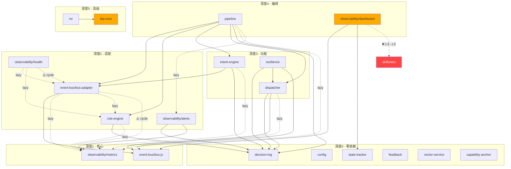

# 依赖方向图 + 禁止线

> **版本**: v1.0.0  
> **日期**: 2026-03-05  
> **状态**: ISC N022 合规输出物 — Day 2  
> **扫描范围**: `infrastructure/` 全量 + `skills/` event-bridge 文件

---

## 1. 层级定义

| 层级 | 位置 | 职责 | 依赖规则 |
|------|------|------|---------|
| **L1 — 基础技能层** | `skills/` (无event-bridge) | 纯功能技能，无跨层通信 | 仅依赖Node.js stdlib + npm包 |
| **L2 — 集成技能层** | `skills/` (有event-bridge) | 通过EventBus参与跨层通信 | 可依赖L1，通过EventBus SDK(待建)与L3通信 |
| **L3 — 基础设施层** | `infrastructure/` | 事件总线、编排、路由、可观测性 | 可依赖L1/L2（通过事件消费），L3内部可依赖 |

---

## 2. 依赖方向图

### 2.1 允许的依赖方向

```
  ┌─────────────────────────────────────────────────────────────────┐
  │                    允许方向：向下单向依赖                         │
  │                                                                 │
  │  ┌─────────────────────────────────────────────────────────┐    │
  │  │ L3 基础设施层 (infrastructure/)                         │    │
  │  │                                                         │    │
  │  │  pipeline ──→ intent-engine ──→ event-bus(adapter)      │    │
  │  │     │              │                  │                 │    │
  │  │     ├──→ dispatcher ├──→ decision-log  ├──→ bus.js(core)│    │
  │  │     │         │     │                                   │    │
  │  │     ├──→ rule-engine ├──→ observability/metrics         │    │
  │  │     │                                                   │    │
  │  │  resilience ──→ dispatcher, event-bus, decision-log     │    │
  │  │  mr ──→ lep-core                                       │    │
  │  │                                                         │    │
  │  │  独立模块(零依赖): config, state-tracker, feedback,     │    │
  │  │    vector-service, capability-anchor, decision-log      │    │
  │  └────────────────────────┬────────────────────────────────┘    │
  │                           │ ✅ 允许                             │
  │                           ▼                                     │
  │  ┌─────────────────────────────────────────────────────────┐    │
  │  │ L2 集成技能层 (skills/ 有 event-bridge)                 │    │
  │  │                                                         │    │
  │  │  isc-core/event-bridge.js                               │    │
  │  │  aeo/event-bridge.js                                    │    │
  │  │  cras/event-bridge.js, rule-suggester.js                │    │
  │  │  seef/event-bridge.js                                   │    │
  │  │  dto-core/event-bridge.js                               │    │
  │  └────────────────────────┬────────────────────────────────┘    │
  │                           │ ✅ 允许                             │
  │                           ▼                                     │
  │  ┌─────────────────────────────────────────────────────────┐    │
  │  │ L1 基础技能层 (skills/ 无 event-bridge)                 │    │
  │  │                                                         │    │
  │  │  glm-asr, glm-tts, glm-image, cogview, cogvideo,       │    │
  │  │  file-sender, tavily-search, zhipu-vision, convert,     │    │
  │  │  github-api, parallel-subagent, _shared, ...            │    │
  │  └─────────────────────────────────────────────────────────┘    │
  └─────────────────────────────────────────────────────────────────┘
```

### 2.2 禁止线（🚫 FORBIDDEN）

```
  🚫🚫🚫🚫🚫🚫🚫🚫🚫🚫🚫🚫🚫🚫🚫🚫🚫🚫🚫🚫🚫🚫🚫🚫🚫🚫🚫🚫🚫
  🚫                                                              🚫
  🚫  ❌ L1 ──✕──→ L3    (基础技能不得require基础设施模块)          🚫
  🚫  ❌ L2 ──✕──→ L3    (集成技能不得直接require基础设施模块)      🚫
  🚫  ❌ L3 ──✕──→ L1/L2 (基础设施不得require技能模块)             🚫
  🚫  ❌ L3 ↔ L3 循环    (基础设施模块间禁止循环依赖)              🚫
  🚫  ❌ 任何层 → .secrets/ (禁止硬编码密钥路径)                    🚫
  🚫                                                              🚫
  🚫🚫🚫🚫🚫🚫🚫🚫🚫🚫🚫🚫🚫🚫🚫🚫🚫🚫🚫🚫🚫🚫🚫🚫🚫🚫🚫🚫🚫
```

**关键约束**：L2(skills/)与L3(infrastructure/)之间的事件通信 **必须** 通过EventBus SDK（薄客户端），而非直接 `require('../../infrastructure/...')`。

---

## 3. L3层模块依赖矩阵

### 3.1 模块清单（按依赖深度排序）

| 深度 | 模块 | 路径 | 依赖的L3模块 |
|------|------|------|-------------|
| 0 | **decision-log** | `infrastructure/decision-log/` | _(无)_ |
| 0 | **config** | `infrastructure/config/` | _(无)_ |
| 0 | **state-tracker** | `infrastructure/state-tracker/` | _(无)_ |
| 0 | **feedback** | `infrastructure/feedback/` | _(无)_ |
| 0 | **vector-service** | `infrastructure/vector-service/` | _(无)_ |
| 0 | **capability-anchor** | `infrastructure/capability-anchor/` | _(无)_ |
| 1 | **event-bus** (bus.js) | `infrastructure/event-bus/bus.js` | _(无)_ |
| 1 | **observability/metrics** | `infrastructure/observability/metrics.js` | _(无)_ |
| 1 | **observability/eval-collector** | `infrastructure/observability/eval-collector.js` | _(无)_ |
| 2 | **event-bus** (bus-adapter) | `infrastructure/event-bus/bus-adapter.js` | bus.js, ⚠️observability/metrics(lazy), ⚠️rule-engine(lazy) |
| 2 | **rule-engine** | `infrastructure/rule-engine/` | decision-log, ⚠️observability/metrics(lazy) |
| 2 | **observability/alerts** | `infrastructure/observability/alerts.js` | decision-log, metrics |
| 2 | **observability/health** | `infrastructure/observability/health.js` | ⚠️bus-adapter(lazy), ⚠️rule-engine(lazy) |
| 3 | **dispatcher** | `infrastructure/dispatcher/` | decision-log, event-bus, observability/metrics |
| 3 | **intent-engine** | `infrastructure/intent-engine/` | event-bus/bus-adapter, decision-log, ⚠️observability/metrics(lazy) |
| 3 | **observability** (index) | `infrastructure/observability/index.js` | metrics, health, alerts, l3-dashboard |
| 3 | **resilience** | `infrastructure/resilience/` | decision-log, dispatcher, event-bus |
| 4 | **pipeline** | `infrastructure/pipeline/` | bus-adapter, rule-engine, intent-engine, dispatcher, decision-log, ⚠️observability(lazy) |
| 4 | **observability/l3-dashboard** | `infrastructure/observability/l3-dashboard.js` | metrics(lazy), health(lazy), alerts(lazy), decision-log(lazy) |
| 4 | **observability/dashboard** | `infrastructure/observability/dashboard.js` | event-bus/bus.js, state-tracker, ❌skills/aeo(!) |
| 5 | **mr** | `infrastructure/mr/` | lep-core |
| 5 | **lep-core** | `infrastructure/lep-core/` | ❌dto-core(!), ❌parallel-subagent(!), ❌feishu-chat-backup(!) |

### 3.2 L3→L3 依赖关系图（Mermaid）



### 3.3 检测到的循环依赖（均为lazy/try-catch）

| 循环路径 | 严重程度 | 说明 |
|----------|---------|------|
| event-bus/bus-adapter ↔ observability/metrics | ⚠️ 低 | bus-adapter用try/catch加载metrics，运行时不会死锁 |
| event-bus/bus-adapter ↔ rule-engine ↔ observability | ⚠️ 低 | bus-adapter内部函数延迟加载rule-matcher |
| observability/health ↔ event-bus/bus-adapter | ⚠️ 低 | health内部函数延迟加载bus-adapter |
| observability/health ↔ rule-engine ↔ observability | ⚠️ 低 | 函数级延迟加载 |

**结论**：当前无硬循环（模块加载时不会死锁），但存在4条lazy循环路径。建议通过依赖注入消除。

---

## 4. 当前违规清单

### 4.1 L2→L3 违规（skills/ require infrastructure/）

| # | 文件 | 引用目标 | 违规类型 |
|---|------|---------|---------|
| 1 | `skills/isc-core/event-bridge.js:11` | `infrastructure/event-bus/bus.js` | L2→L3直接require |
| 2 | `skills/seef/event-bridge.js:22` | `infrastructure/event-bus/bus.js` | L2→L3直接require |
| 3 | `skills/cras/rule-suggester.js:12` | `infrastructure/event-bus/bus-adapter` | L2→L3直接require |
| 4 | `skills/cras/event-bridge.js:15` | `infrastructure/event-bus/bus-adapter` | L2→L3直接require |
| 5 | `skills/dto-core/event-bridge.js:7` | `infrastructure/event-bus/bus.js` | L2→L3直接require |
| 6 | `skills/aeo/event-bridge.js:4` | `infrastructure/event-bus/bus.js` | L2→L3直接require |

**修复方案**：创建 `infrastructure/event-bus/sdk.js` 薄客户端，skills/ 通过SDK与EventBus交互，而非直接require bus.js/bus-adapter.js。

### 4.2 L3→L1/L2 违规（infrastructure/ require skills/）

| # | 文件 | 引用目标 | 违规类型 |
|---|------|---------|---------|
| 1 | `infrastructure/observability/dashboard.js:56` | `skills/aeo/assessment-store.js` | L3→L2直接require |
| 2 | `infrastructure/lep-core/core/LEPExecutor.js:742` | `../dto-core/...` (phantom→skills/) | L3→L2幻影依赖 |
| 3 | `infrastructure/lep-core/core/LEPExecutor.js:18` | `../parallel-subagent/...` (phantom→skills/) | L3→L1幻影依赖 |
| 4 | `infrastructure/lep-core/executors/base.js:131` | `../../feishu-chat-backup` (phantom→skills/) | L3→L2幻影依赖 |

### 4.3 .secrets 硬编码违规

| # | 文件 | 说明 |
|---|------|------|
| 1 | `infrastructure/vector-service/src/zhipu-vectorizer.cjs:31` | 硬编码 `.secrets/zhipu-keys.env` |
| 2 | `infrastructure/intent-engine/intent-scanner.js:33` | 硬编码 `.secrets/zhipu-keys.env` |
| 3 | `skills/zhipu-vision/index.js:5` | 硬编码 `.secrets/zhipu-keys.env` |
| 4 | `skills/zhipu-image-gen/index.js:5` | 硬编码 `.secrets/zhipu-keys.env` |

**正确做法**：通过环境变量或 `skills/_shared/paths.js` 的 `SECRETS_DIR` 常量访问。

---

## 5. CI门禁规则（5条）

| # | 规则ID | 规则内容 | 检查方式 |
|---|--------|---------|---------|
| 1 | **DEP-001** | L1不得依赖L3 | skills/非event-bridge文件禁止require infrastructure/ |
| 2 | **DEP-002** | L2不得依赖L3 | skills/event-bridge文件禁止直接require infrastructure/（SDK除外） |
| 3 | **DEP-003** | L3模块间无循环依赖 | 静态分析require图，检测强循环（排除try-catch lazy加载） |
| 4 | **DEP-004** | 外部依赖必须在package.json声明 | require非相对路径且非Node.js内建的包必须在package.json |
| 5 | **DEP-005** | 禁止直接require .secrets/ | 所有文件禁止硬编码 `.secrets` 路径 |

实现详见 `scripts/dependency-check.js`。

---

## 6. 修复优先级

| 优先级 | 违规 | 修复方案 | 影响范围 |
|--------|------|---------|---------|
| P0 | .secrets硬编码 (4处) | 改用env var或_shared/paths.js | 4个文件 |
| P1 | L3→L2 (dashboard→aeo) | dashboard通过事件消费aeo数据 | 1个文件 |
| P1 | lep-core幻影依赖 (3处) | 删除或改为动态路径+try-catch | 2个文件 |
| P2 | L2→L3 event-bridge (6处) | 创建event-bus/sdk.js薄客户端 | 6个文件 |
| P3 | Lazy循环 (4条路径) | 依赖注入重构 | 跨多模块 |
