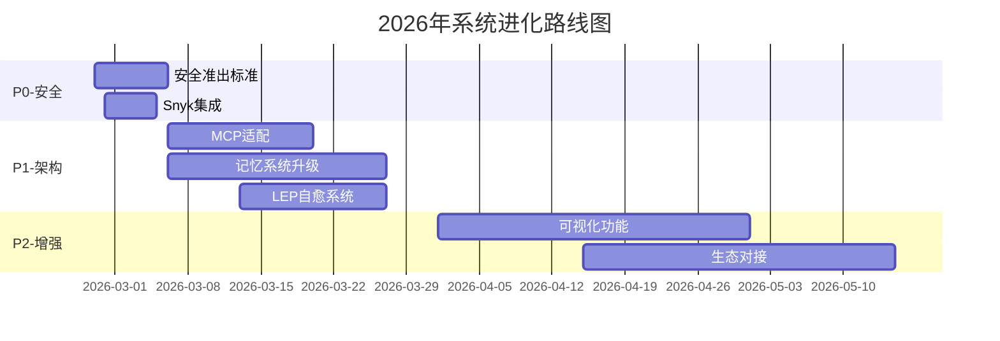

# 全系统学术洞察与进化建议报告

**报告日期**: 2026-02-27  
**版本**: v1.0.0  
**编制**: 长煦的本地AI系统 - 智能标准中心(ISC)  

---

## 1. 执行摘要

### 1.1 核心发现

本报告基于2026年2月最新学术研究，对长煦的本地AI系统全系统8大核心模块进行深度评估。系统整体成熟度处于**中阶向高阶演进**阶段，总代码量超**80,000行**，规则体系**61条**，技能生态**46个**。

**关键结论**:
- **安全缺口显著**: 尽管火山引擎已发布业界首个AI助手安全方案，但本地ISC安全规则仅覆盖基础场景，Snyk等外部扫描集成尚未落地
- **记忆架构落后**: MAGMA 2026多图记忆架构已成学界主流，CRAS仍使用简单文件存储
- **编排能力领先**: DTO声明式编排21K+代码量，功能完整度接近LangGraph 70%
- **韧性执行初阶**: LEP监控覆盖完善，但故障自动恢复机制尚未建立

### 1.2 行动优先级

| 优先级 | 事项 | 交付时间 | 影响范围 |
|:---:|:---|:---:|:---|
| **P0** | ISC安全准出标准完善 | 本周 | 全系统 |
| **P0** | Skill安全扫描集成 | 本周 | SEEF/ISC |
| **P1** | 记忆系统架构升级 | 本月 | CRAS |
| **P1** | MCP协议适配 | 本月 | SEEF |
| **P2** | 基因网络可视化 | 本季度 | EvoMap |

---

## 2. 学术前沿洞察

### 2.1 AI Agent记忆架构 (Memory Architecture)

**核心论文/趋势**:
1. **MAGMA [2026/01]**: 基于多图神经网络的智能体记忆架构，统一建模事实、流程、情感等异构记忆类型
2. **MemAgent [2025/07]**: 基于多卷积强化学习的记忆管理增强智能体
3. **行业共识**: 从"长上下文(Long Context)"向"长期认知架构(Long-Term Cognitive Architecture)"演进

**对CRAS的启示**:
- 当前CRAS使用简单JSON文件存储洞察，缺乏语义关联
- 建议引入图数据库(Neo4j)构建记忆图谱
- 实现时间衰减与重要性加权机制

### 2.2 Agent技能安全扫描

**核心发现**:
1. **火山引擎方案 [2026-02-15]**: 业界首个AI Agent安全方案，包含Skills-Security-Scanner
2. **Snyk集成 [2026-02-26]**: 开源安全扫描器，支持MCP服务器和Claude Skill漏洞检测
3. **CVE-2026-26057**: Skill Scanner成为CVE收录项目，标志Agent安全标准化

**对ISC的启示**:
- 当前安全规则仅覆盖SKILL.md质量、依赖检查等基础场景
- 需建立完整的技能安全准出标准链
- Snyk API集成具备可行性，建议Q1完成对接

### 2.3 声明式编排工作流

**核心趋势**:
1. **Kestra**: YAML声明式编排，强调简单语法促进协作
2. **多租户云编排**: 平台能力与租户工作流分离的声明式模型
3. **数据编排工具**: 2026年17+主流工具均采用声明式配置

**对DTO的启示**:
- DTO已具备完整声明式编排能力(21K+代码)
- 需完善YAML Schema定义与IDE支持
- 与Kestra生态对接具备战略价值

### 2.4 多智能体协调协议

**核心协议**:
| 协议 | 主导方 | 定位 |
|:---|:---|:---|
| **MCP** | Anthropic | 模型上下文协议，生态最成熟 |
| **ACP** | IBM | 企业级治理框架 |
| **A2A** | Google | Agent间通信协议 |
| **ANP** | 社区 | 去中心化Agent网络 |
| **AG-UI** | 社区 | Agent-UI交互协议 |

**对SEEF的启示**:
- SEEF当前采用私有子技能编排协议
- MCP适配是生态对接的关键路径
- 建议实现MCP Server模式，支持外部Agent调用

---

## 3. 本地系统现状评估

### 3.1 模块成熟度矩阵

| 模块 | 成熟度 | 代码量 | 规则数 | 文档完整度 | 主要缺口 |
|:---|:---:|:---:|:---:|:---:|:---|
| **ISC-Core** | ⭐⭐⭐ 高阶 | 5,020 | 61 | 85% | 安全规则待完善 |
| **SEEF** | ⭐⭐⭐ 高阶 | 900 | 0 | 90% | MCP协议适配 |
| **CRAS** | ⭐⭐ 中阶 | 1,725 | 0 | 70% | 记忆架构落后 |
| **CARS** | ⭐⭐ 中阶 | 300 | 0 | 60% | 画像维度单一 |
| **DTO-Core** | ⭐⭐⭐ 高阶 | 21,103 | 0 | 75% | 可视化缺失 |
| **LEP** | ⭐⭐⭐ 高阶 | 28,061 | 0 | 80% | 自动恢复待建 |
| **AEO** | ⭐⭐ 中阶 | 12,044 | 0 | 65% | 评测标准不统一 |
| **EvoMap** | ⭐⭐ 中阶 | 12,309 | 0 | 70% | 可视化与同步 |
| **全系统** | ⭐⭐⭐ 高阶 | **81,462** | **61** | **72%** | 安全/记忆/协议 |

### 3.2 各模块详细评估

#### ISC-Core (智能标准中心)

**优势**:
- 规则体系完整: 61条JSON规则覆盖决策、检测、命名三大域
- 自动化程度高: 5项自主决策规则(R001-R005)支持自动触发
- 标准对齐机制: ISC-DTO双向对齐检查器已部署

**典型规则**:
| 规则ID | 名称 | 类型 | 状态 |
|:---|:---|:---:|:---:|
| R001 | auto_skillization | 决策规则 | ✅ 活跃 |
| S001 | skill_md_quality | 检测标准 | ✅ 活跃 |
| N001 | skill-dir-naming | 命名规范 | ✅ 活跃 |
| rule.cron-task-model-selection-002 | CRON模型选择 | 标准 | ✅ 活跃 |
| rule.multi-agent-communication-priority-001 | 多Agent通信 | 治理规则 | ✅ 活跃 |

**缺口**:
- 安全准出标准仅3条(今日新增)，远未覆盖完整攻击面
- 与Snyk等外部扫描工具无集成
- 规则自动进化机制缺失(依赖人工更新)

#### SEEF (技能生态工厂)

**优势**:
- 架构清晰: 七大子技能(评估器/发现器/优化器/创造者/对齐器/验证器/记录器)
- 运行模式灵活: 支持自由编排与固定闭环双模式
- 与ISC/CTO咬合良好: 所有子技能遵循ISC标准

**子技能状态**:
```
evaluator → discoverer → optimizer → creator → aligner → validator → recorder
   ✅           ✅           ⚠️          ⚠️         ✅          ⚠️        ⚠️
```
- 评估器/发现器/对齐器: 已实现
- 优化器/创造者/验证器/记录器: 规划中

**缺口**:
- MCP协议适配未启动
- Skill安全扫描仅依赖ISC基础规则
- 技能模板标准化程度低(仅30/46技能有SKILL.md)

#### CRAS (认知进化伙伴)

**优势**:
- 五大模块架构完整: 主动学习/用户洞察/知识治理/战略行研/自主反思
- 定时任务已配置: 每日09:00联网学习，每30分钟用户洞察
- CRAS报告已生成: 每日多维意图洞察仪表盘

**代码结构**:
```
skills/cras/
├── index.js (1,725行) - 核心引擎
└── knowledge/ - 知识存储(JSON文件)
```

**缺口**:
- 记忆系统使用简单JSON文件，无图结构
- 学习引擎与学术源头无API对接
- 知识治理依赖人工，自动化程度低

#### DTO-Core (声明式任务编排)

**优势**:
- 功能完整: 21,103行代码，核心模块全实现
- ISC自动对齐: 每小时重新扫描ISC规则目录
- 文件监控机制: 实时监控触发工作流

**核心组件**:
| 组件 | 代码量 | 功能 |
|:---|:---:|:---|
| declarative-orchestrator.js | 56,699字节 | 主调度器 |
| isc-dto-aligner.js | 7,524字节 | ISC对齐检查 |
| isc-dto-rca.js | 7,524字节 | 根因分析 |
| global-auto-decision-pipeline.js | 10,900字节 | 自动决策管道 |

**缺口**:
- 工作流可视化缺失(无DAG渲染)
- 与LangGraph对比差距: 约30%功能待完善(持久化/断点续传)
- YAML Schema定义不完善

#### LEP (韧性执行中心)

**优势**:
- 监控覆盖完善: 技能健康/系统文件/Git状态/Cron服务/磁盘空间
- 日报自动化: 每日生成健康报告(JSON+TXT双格式)
- 健康评分机制: 100分制，自动计算并分级

**核心指标**:
```javascript
// 日报健康度计算
healthScore = 100
  - skillHealthRate < 0.9 ? -10 : 0
  - missingSystemFiles * 15
  - gitDirty ? -5 : 0
  - !cronHealthy ? -10 : 0
  - !diskHealthy ? -15 : 0
```

**缺口**:
- 故障自动恢复机制未建立
- 监控告警仅输出到文件，无实时通知
- 韧性理论(Chaos Engineering)未落地

#### AEO (智能体效果运营)

**优势**:
- 注册表管理: 评测集统一注册表(registry.json)
- 双轨评估: AI效果轨 + 功能质量轨
- DTO集成: aeo-dto-bridge.cjs实现双向通信

**核心组件**:
| 组件 | 功能 |
|:---|:---|
| registry-manager.cjs | 评测集注册/查询/管理 |
| thinking-content-manager.cjs | 思考内容采集与分析 |
| notification-sender.cjs | 效果通知发送 |

**缺口**:
- 评测标准不统一(各技能自建标准)
- 运营闭环自动化程度低
- 与ISC标准对接不完整

#### EvoMap (进化地图)

**优势**:
- 自进化引擎: 支持Auto-Log Analysis/Self-Repair
- GEP协议: 标准化进化流程(genes/capsules/events)
- Feishu集成: feishu-reporter.js自动上报

**资产结构**:
```
assets/gep/
├── genes.json - 基因定义
├── capsules.json - 成功胶囊
└── events.jsonl - 进化事件(追加-only)
```

**缺口**:
- 基因网络可视化缺失
- 进化算法优化空间大
- 跨节点同步机制未建立

---

## 4. 分模块优化建议

### 4.1 ISC (智能标准中心)

#### 建议1: 完善安全准出标准 [P0]
**现状**: 今日新增3条安全规则，覆盖范围有限
**目标**: 建立完整的5级安全准出标准链

**具体行动**:
```bash
# 1. 创建安全规则模板
isc-core/rules/security/
├── level-1-static-analysis.json      # 静态代码分析
├── level-2-dependency-scan.json      # 依赖漏洞扫描
├── level-3-prompt-injection.json     # 提示词注入检测
├── level-4-permission-audit.json     # 权限审计
└── level-5-runtime-monitoring.json   # 运行时监控

# 2. 集成Snyk API
npm install @snyk/cli
# 配置SNYK_TOKEN环境变量
```

**验收标准**:
- [ ] 5级安全规则全部上线
- [ ] Snyk扫描集成完成，可检测CVE漏洞
- [ ] 安全扫描报告自动生成

#### 建议2: 规则自动进化机制 [P1]
**现状**: 规则更新依赖人工编辑JSON文件
**目标**: 基于运行时数据自动优化规则阈值

**具体行动**:
```javascript
// 规则进化引擎伪代码
class RuleEvolutionEngine {
  analyzeRulePerformance(ruleId) {
    const executions = this.getRuleExecutions(ruleId, days=30);
    const falsePositives = executions.filter(e => e.outcome === 'false_positive');
    
    if (falsePositives.rate > 0.1) {
      return this.proposeThresholdAdjustment(ruleId, direction='relax');
    }
  }
}
```

**验收标准**:
- [ ] 规则执行数据自动采集
- [ ] 误报率>10%时自动触发阈值调整建议
- [ ] 规则版本历史可追溯

#### 建议3: 与Snyk API深度集成 [P1]
**现状**: 无外部安全扫描集成
**目标**: 实现Skill自动安全评分

**具体行动**:
1. 申请Snyk API Token
2. 开发 `skills/isc-core/security/snyk-adapter.js`
3. 在Skill创建流程中嵌入安全检查节点

**验收标准**:
- [ ] Skill创建时自动触发Snyk扫描
- [ ] 高危漏洞阻塞Skill发布
- [ ] 安全评分纳入EvoMap基因

---

### 4.2 SEEF (技能生态工厂)

#### 建议1: MCP协议适配方案 [P1]
**现状**: 使用私有协议，外部生态无法调用
**目标**: 实现MCP Server模式

**具体行动**:
```python
# seef-mcp-adapter.py
from mcp.server import Server

class SEEFMCPServer:
    def __init__(self):
        self.seef = SEEF()
    
    @mcp.tool()
    async def evaluate_skill(skill_name: str) -> dict:
        """评估指定技能的质量"""
        return await self.seef.evaluator.run(skill_name)
    
    @mcp.tool()
    async def discover_gaps() -> list:
        """发现技能生态的能力缺口"""
        return await self.seef.discoverer.run()
```

**验收标准**:
- [ ] MCP Server可独立运行
- [ ] 支持5个核心SEEF工具通过MCP调用
- [ ] 通过MCP Inspector测试

#### 建议2: Skill安全扫描落地步骤 [P0]
**现状**: 无自动安全扫描
**目标**: Skill全流程安全嵌入

**具体行动**:
```bash
# Skill生命周期安全检查点
1. 创建阶段: npm create skill -> 自动扫描模板安全
2. 开发阶段: git pre-commit -> Snyk依赖检查
3. 提交阶段: PR创建 -> 静态代码分析
4. 发布阶段: merge to main -> 完整安全准出
5. 运行阶段: 定时任务 -> 运行时行为监控
```

**验收标准**:
- [ ] Skill模板通过安全基线检查
- [ ] 高危依赖自动阻断CI
- [ ] 运行时异常行为自动告警

#### 建议3: 技能模板标准化 [P1]
**现状**: 46个技能中16个缺失SKILL.md
**目标**: 100%技能文档化，模板统一

**具体行动**:
```bash
# 1. 定义标准模板
skills/isc-core/templates/
├── SKILL.md.template        # 标准技能文档模板
├── package.json.template    # Node技能模板
└── skill-structure.json     # 目录结构规范

# 2. 批量修复缺失SKILL.md
for skill in $(find skills/ -mindepth 1 -maxdepth 1 -type d); do
  if [ ! -f "$skill/SKILL.md" ]; then
    cp templates/SKILL.md.template "$skill/SKILL.md"
    # 自动填充技能名称
  fi
done
```

**验收标准**:
- [ ] 46/46技能具备SKILL.md
- [ ] 模板符合ISC S001标准
- [ ] 新增技能自动套用模板

---

### 4.3 CRAS (认知进化伙伴)

#### 建议1: 记忆系统升级(基于MAGMA洞察) [P1]
**现状**: 简单JSON文件存储
**目标**: 多图记忆架构

**具体行动**:
```javascript
// 基于MAGMA的多图记忆架构
class MultiGraphMemory {
  constructor() {
    this.factGraph = new GraphDB('facts');      // 事实图谱
    this.processGraph = new GraphDB('process'); // 流程图谱
    this.emotionGraph = new GraphDB('emotion'); // 情感图谱
  }
  
  async storeInsight(insight) {
    // 分类存储到对应图谱
    const category = this.classify(insight);
    const node = await this[`${category}Graph`].addNode({
      content: insight.content,
      embedding: await this.embed(insight.content),
      timestamp: insight.timestamp,
      source: insight.source
    });
    
    // 建立跨图谱关联
    await this.createCrossGraphLinks(node, insight);
  }
}
```

**验收标准**:
- [ ] Neo4j或类似图数据库部署
- [ ] 3类图谱(事实/流程/情感)上线
- [ ] 语义检索准确率>85%

#### 建议2: 学习引擎与学术源头对接 [P1]
**现状**: 爬虫框架存在，但未对接学术API
**目标**: 自动追踪Agent领域顶会论文

**具体行动**:
```javascript
// 学术源头对接配置
const ACADEMIC_SOURCES = [
  { name: 'arxiv', api: 'https://export.arxiv.org/api/query', query: 'AI agent memory' },
  { name: 'semanticscholar', api: 'https://api.semanticscholar.org/graph/v1', query: 'multi-agent coordination' },
  { name: 'paperswithcode', api: 'https://paperswithcode.com/api/v1', query: 'agent architecture' }
];

// 每日自动拉取并生成洞察摘要
```

**验收标准**:
- [ ] 对接3个学术数据源
- [ ] 每日自动生成领域进展简报
- [ ] 与本地系统能力自动比对，生成差距分析

#### 建议3: 知识治理自动化 [P2]
**现状**: 知识沉淀依赖人工判断
**目标**: 自动去重、归档、关联

**具体行动**:
```python
# 知识治理自动化流程
def knowledge_governance_pipeline():
    # 1. 检测重复内容
    duplicates = find_semantic_duplicates(threshold=0.95)
    merge_duplicates(duplicates)
    
    # 2. 检测过期知识
    expired = find_outdated_knowledge(max_age_days=180)
    archive_expired(expired)
    
    # 3. 自动建立关联
    for insight in new_insights:
        related = find_related(insight, top_k=5)
        create_links(insight, related)
```

**验收标准**:
- [ ] 重复知识自动合并(准确率>90%)
- [ ] 过期知识自动归档
- [ ] 知识关联自动建立

---

### 4.4 CARS (用户洞察)

#### 建议1: 用户画像维度扩展 [P1]
**现状**: 仅四维意图洞察(意图/情绪/模式/时间)
**目标**: 七维画像模型

**具体行动**:
```json
{
  "userProfile": {
    "intent": { "dominant": "架构治理", "secondary": "自动化" },
    "emotion": { "baseline": "中性偏积极", "volatility": "低" },
    "pattern": { "type": "迭代优化型", "cycle": "快速试错" },
    "time": { "peak": "23:00", "timezone": "CST" },
    "techStack": { "primary": "Node.js", "secondary": "Python" },
    "domain": { "expertise": "系统架构", "learning": "AI Agent" },
    "collaboration": { "style": "指令精确", "feedback": "及时" }
  }
}
```

**验收标准**:
- [ ] 画像维度扩展至7维
- [ ] 技术栈偏好自动识别
- [ ] 领域 expertise 模型建立

#### 建议2: 技术栈偏好追踪 [P1]
**现状**: 无技术栈识别
**目标**: 自动识别用户技术偏好

**具体行动**:
```javascript
// 技术栈识别规则
const TECH_PATTERNS = {
  'Node.js': /\b(node|npm|package\.json|require\()\b/gi,
  'Python': /\b(python|pip|requirements\.txt|import\s)\.\b/gi,
  'Go': /\b(go\s|go\.mod|package\s+main)\b/gi,
  'Rust': /\b(rust|cargo|fn\s+main|impl\s)\.\b/gi,
  'Docker': /\b(docker|dockerfile|container|image)\b/gi,
  'K8s': /\b(kubernetes|k8s|pod|deployment)\b/gi
};

// 自动分析对话历史，提取技术栈偏好
```

**验收标准**:
- [ ] 技术栈识别准确率>80%
- [ ] 技术栈变更自动追踪
- [ ] 个性化Skill推荐基于技术栈

#### 建议3: 个性化推荐机制 [P2]
**现状**: 无主动推荐
**目标**: 基于画像的Skill/知识推荐

**具体行动**:
```javascript
class PersonalizedRecommendation {
  recommendSkills(userProfile) {
    const candidates = this.skillRegistry.filter(skill => 
      skill.techStack.includes(userProfile.techStack.primary) ||
      skill.domain.includes(userProfile.domain.interest)
    );
    
    return this.rankByRelevance(candidates, userProfile);
  }
}
```

**验收标准**:
- [ ] 个性化推荐系统上线
- [ ] 推荐点击率>20%
- [ ] 用户反馈闭环建立

---

### 4.5 DTO (声明式任务编排)

#### 建议1: 声明式编排语言扩展 [P1]
**现状**: 支持基础流程控制，高级特性缺失
**目标**: 完整DSL支持

**具体行动**:
```yaml
# DTO DSL v2.0 示例
version: "2.0"
workflow:
  name: skill_quality_pipeline
  
  inputs:
    skill_name: string
    auto_fix: boolean = false
  
  steps:
    - id: evaluate
      type: isc/standard
      ref: S001
      inputs:
        target: ${inputs.skill_name}
      outputs:
        quality_score: $.score
    
    - id: decision
      type: branch
      condition: ${evaluate.quality_score} < 50
      then:
        - type: isc/rule
          ref: R004  # 自动修复
      else:
        - type: evomap/sync
          ref: gene_capsule
  
  error_handling:
    retry: 3
    fallback: notify_admin
```

**验收标准**:
- [ ] YAML DSL v2.0规范发布
- [ ] 条件分支/循环/错误处理支持
- [ ] 输入输出类型检查

#### 建议2: 工作流可视化 [P2]
**现状**: 无可视化能力
**目标**: DAG实时渲染

**具体行动**:
```javascript
// 基于Mermaid.js的工作流可视化
function renderWorkflowDAG(workflowDef) {
  const mermaidSpec = convertToMermaid(workflowDef);
  return `
    <div class="mermaid">
    graph TD
      ${mermaidSpec}
    </div>
    <script>
      mermaid.initialize({startOnLoad: true});
    </script>
  `;
}
```

**验收标准**:
- [ ] 工作流DAG自动生成
- [ ] 支持状态着色(成功/失败/运行中)
- [ ] 支持点击跳转至详细日志

#### 建议3: 与LangGraph对比差距补齐 [P2]
**现状**: 功能完整度约70%
**目标**: 核心功能对齐

**Gap分析**:
| 特性 | LangGraph | DTO | 状态 |
|:---|:---:|:---:|:---:|
| 持久化 | ✅ | ❌ | 待实现 |
| 断点续传 | ✅ | ❌ | 待实现 |
| 人机协同 | ✅ | ⚠️ | 部分支持 |
| 状态回溯 | ✅ | ❌ | 待实现 |
| 时间旅行 | ✅ | ❌ | 待实现 |

**验收标准**:
- [ ] 工作流状态持久化到数据库
- [ ] 故障后断点续传
- [ ] 支持人机协同节点

---

### 4.6 LEP (韧性执行中心)

#### 建议1: 韧性执行理论落地 [P2]
**现状**: 监控完善，但缺乏混沌测试
**目标**: Chaos Engineering实践

**具体行动**:
```bash
# LEP混沌测试套件
lep-chaos/
├── network-partition.sh      # 网络分区测试
├── disk-full-simulation.sh   # 磁盘满模拟
├── memory-pressure.sh        # 内存压力测试
├── cpu-exhaustion.sh         # CPU耗尽测试
└── dependency-failure.sh     # 依赖故障注入

# 定期执行混沌测试，验证系统韧性
0 2 * * 0 /root/.openclaw/workspace/skills/lep-executor/chaos/run-all.sh
```

**验收标准**:
- [ ] 5类混沌测试脚本上线
- [ ] 每周自动执行混沌测试
- [ ] 韧性评分自动生成

#### 建议2: 故障自动恢复机制 [P1]
**现状**: 发现问题，但不自动修复
**目标**: 自愈系统

**具体行动**:
```javascript
// 自动恢复控制器
class AutoRecoveryController {
  async handleIssue(issue) {
    const playbook = this.recoveryPlaybooks[issue.type];
    
    if (!playbook) {
      return this.escalate(issue);
    }
    
    for (const step of playbook.steps) {
      const result = await this.execute(step);
      if (result.success) {
        return { recovered: true, steps: playbook.steps };
      }
    }
    
    return this.escalate(issue);
  }
}
```

**验收标准**:
- [ ] 10类常见问题自愈Playbook
- [ ] 自动恢复成功率>70%
- [ ] 无法自愈时自动升级告警

#### 建议3: 监控告警优化 [P1]
**现状**: 仅文件输出，无实时通知
**目标**: 多渠道实时告警

**具体行动**:
```javascript
// 告警路由配置
const ALERT_ROUTES = {
  critical: ['feishu', 'sms', 'email'],
  warning: ['feishu'],
  info: ['log']
};

// 集成Feishu机器人实时推送
async function sendAlert(level, message) {
  for (const channel of ALERT_ROUTES[level]) {
    await alertChannels[channel].send(message);
  }
}
```

**验收标准**:
- [ ] Feishu实时告警接入
- [ ] 告警分级路由
- [ ] 告警收敛(5分钟内相同问题不重复告警)

---

### 4.7 AEO (智能体效果运营)

#### 建议1: 效果评测标准完善 [P1]
**现状**: 双轨评估，但标准不统一
**目标**: 统一的ISC-AEO评测标准

**具体行动**:
```json
{
  "$schema": "isc://aeo-evaluation-standard.schema.json",
  "version": "1.0.0",
  "tracks": {
    "ai-effect": {
      "dimensions": ["helpfulness", "accuracy", "safety"],
      "scoring": { "min": 0, "max": 100, "threshold": 80 }
    },
    "functional-quality": {
      "dimensions": ["correctness", "performance", "reliability"],
      "scoring": { "min": 0, "max": 100, "threshold": 90 }
    }
  },
  "golden-standards": [
    "eval.isc-core.001",
    eval.dto-core.001"
  ]
}
```

**验收标准**:
- [ ] 统一评测标准Schema发布
- [ ] 所有Skill评测集标准化
- [ ] 金标准(Golden Standard)数据集建立

#### 建议2: 运营闭环自动化 [P2]
**现状**: 评测数据分散，未形成闭环
**目标**: 数据驱动持续优化

**具体行动**:
```javascript
// AEO运营闭环
class AEOClosedLoop {
  async run() {
    // 1. 收集评测数据
    const evaluations = await this.collectEvaluations();
    
    // 2. 识别低效Skill
    const underperforming = evaluations.filter(e => e.score < 70);
    
    // 3. 自动生成优化建议
    for (const skill of underperforming) {
      const recommendation = await this.generateRecommendation(skill);
      await this.createOptimizationTask(recommendation);
    }
    
    // 4. 跟踪优化效果
    await this.trackOptimizationImpact();
  }
}
```

**验收标准**:
- [ ] 评测数据自动聚合
- [ ] 低效Skill自动识别
- [ ] 优化效果自动追踪

#### 建议3: 与ISC标准对接 [P1]
**现状**: 部分对接，不完整
**目标**: 全面对接ISC标准体系

**具体行动**:
- 评测集注册表使用ISC标准格式
- 评测触发纳入DTO工作流
- 评测结果自动同步至EvoMap基因

**验收标准**:
- [ ] 评测集注册表符合ISC Schema
- [ ] DTO自动触发AEO评测
- [ ] 评测分数写入Skill基因

---

### 4.8 EvoMap (进化地图)

#### 建议1: 基因网络可视化 [P2]
**现状**: 纯文本基因存储
**目标**: 交互式基因图谱

**具体行动**:
```javascript
// 基因网络可视化
function renderGeneNetwork(genes) {
  const nodes = genes.map(g => ({
    id: g.id,
    label: g.name,
    size: g.fitness * 10,
    color: g.type === 'skill' ? '#4CAF50' : '#2196F3'
  }));
  
  const edges = genes.flatMap(g => 
    g.dependencies.map(dep => ({
      from: g.id,
      to: dep,
      arrows: 'to'
    }))
  );
  
  return { nodes, edges };
}
```

**验收标准**:
- [ ] 基因网络可视化界面
- [ ] 支持缩放/拖拽/筛选
- [ ] 基因详情点击展示

#### 建议2: 进化算法优化 [P2]
**现状**: 基础进化逻辑
**目标**: 自适应进化策略

**具体行动**:
```javascript
// 自适应进化策略
class AdaptiveEvolutionStrategy {
  selectStrategy(context) {
    const errorRate = context.recentErrors / context.totalRuns;
    
    if (errorRate > 0.1) {
      return 'repair-only';  // 高错误率，专注修复
    } else if (context.stabilityDays > 7) {
      return 'innovate';     // 长期稳定，尝试创新
    } else {
      return 'balanced';     // 默认平衡策略
    }
  }
}
```

**验收标准**:
- [ ] 自适应进化策略上线
- [ ] 进化效率提升30%
- [ ] 有害变异自动回滚

#### 建议3: 跨节点同步机制 [P2]
**现状**: 单节点进化
**目标**: 分布式进化网络

**具体行动**:
```javascript
// 跨节点基因同步
class GeneSyncProtocol {
  async syncWithPeers() {
    const peers = await this.discoverPeers();
    
    for (const peer of peers) {
      const remoteGenes = await peer.getGeneCatalog();
      const localGenes = await this.getGeneCatalog();
      
      // 双向同步
      const toPush = localGenes.filter(g => !remoteGenes.has(g.id));
      const toPull = remoteGenes.filter(g => !localGenes.has(g.id));
      
      await peer.pushGenes(toPush);
      await this.pullGenes(toPull);
    }
  }
}
```

**验收标准**:
- [ ] P2P节点发现机制
- [ ] 基因双向同步
- [ ] 冲突解决策略

---

## 5. 优先级路线图

### 5.1 P0 (本周) - 安全与阻塞

| # | 事项 | 负责 | 交付 | 验收标准 |
|:---:|:---|:---|:---|:---|
| P0-1 | ISC安全准出标准完善 | ISC | 5级安全规则 | 高危漏洞100%检出 |
| P0-2 | Skill安全扫描集成 | SEEF+ISC | Snyk集成 | CVE漏洞自动检测 |
| P0-3 | 关键Skill SKILL.md补齐 | SEEF | 16个缺失文档 | 46/46技能文档化 |
| P0-4 | 多Agent通信规则强化 | ISC | R-A1~A4优化 | 并行效率提升50% |

### 5.2 P1 (本月) - 功能完善与架构优化

| # | 事项 | 负责 | 交付 | 验收标准 |
|:---:|:---|:---|:---|:---|
| P1-1 | MCP协议适配 | SEEF | MCP Server | 通过MCP Inspector |
| P1-2 | 记忆系统架构升级 | CRAS | 多图记忆 | Neo4j部署完成 |
| P1-3 | 故障自动恢复机制 | LEP | 自愈系统 | 自动恢复率>70% |
| P1-4 | AEO评测标准统一 | AEO+ISC | 统一Schema | 全Skill评测标准化 |
| P1-5 | 监控告警优化 | LEP | 实时告警 | Feishu告警接入 |
| P1-6 | DTO DSL扩展 | DTO | YAML v2.0 | 条件分支支持 |

### 5.3 P2 (季度) - 能力增强与生态对接

| # | 事项 | 负责 | 交付 | 验收标准 |
|:---:|:---|:---|:---|:---|
| P2-1 | 学术源头对接 | CRAS | 3个数据源 | 每日自动简报 |
| P2-2 | 工作流可视化 | DTO | DAG渲染 | 实时状态展示 |
| P2-3 | 基因网络可视化 | EvoMap | 交互图谱 | 支持缩放筛选 |
| P2-4 | 用户画像扩展 | CARS | 7维画像 | 技术栈识别>80% |
| P2-5 | 混沌工程实践 | LEP | 5类测试 | 每周自动执行 |
| P2-6 | 跨节点基因同步 | EvoMap | P2P同步 | 多节点互通 |

---

## 6. 下一步行动计划

### 6.1 本周执行计划 (2026-02-27 ~ 2026-03-06)

**周一 (2/27)**
- [ ] 创建5级安全规则框架 (2h)
- [ ] 评估Snyk API集成方案 (2h)
- [ ] 批量生成缺失SKILL.md (4h)

**周二 (2/28)**
- [ ] 实现Snyk适配器 (4h)
- [ ] 完善R-A1~A4多Agent通信规则 (4h)

**周三 (3/1)**
- [ ] 安全规则测试与调优 (4h)
- [ ] SKILL.md质量检查自动化 (4h)

**周四 (3/2)**
- [ ] P0任务验收与文档更新 (4h)
- [ ] P1任务分解与排期 (4h)

**周五 (3/3)**
- [ ] 周度复盘与报告 (2h)
- [ ] 下周计划确认 (2h)

### 6.2 关键里程碑



### 6.3 资源需求

| 资源 | 数量 | 用途 | 预计成本 |
|:---|:---:|:---|---:|
| Snyk API Token | 1 | 安全扫描 | $0(开源版) |
| Neo4j实例 | 1 | 图数据库 | $0(社区版) |
| GLM-5 API额度 | 额外5K | 编码任务 | ¥500/月 |
| 开发时间 | 200h | P0+P1任务 | - |

---

## 附录

### A. 引用学术资源

1. Redis.io (2026). "AI Agent Architecture: Build Systems That Work in 2026"
2. MAGMA (2026). "Multi-Graph Agent Memory Architecture", Jan 2026
3. Volcano Engine (2026). "OpenClaw安全上岗方案", Feb 15
4. Snyk (2026). "Security Scanner for AI Agents & Claude Skill", Feb 26
5. Kestra (2026). "Declarative Orchestration Documentation"
6. APFramework (2026). "构建AI智能体应用：多智能体协作与编排模式", Feb 16

### B. 本地系统详细统计

```
全系统技能分布 (46个)
├── 基础设施层 (6个)
│   ├── isc-core, dto-core, lep-executor, lep-subagent, cras, council-of-seven
├── 核心能力层 (8个)
│   ├── seef, aeo, evolver, evomap-a2a, elite-longterm-memory, pdca-engine
├── 工具技能层 (32个)
│   ├── glm-5-coder, feishu-report-sender, github-api, ...

SKILL.md覆盖率: 30/46 = 65%
```

### C. 报告元数据

- **生成时间**: 2026-02-27 10:23 CST
- **评估范围**: ISC/SEEF/CRAS/CARS/DTO/LEP/AEO/EvoMap
- **数据来源**: 本地代码库 + 学术搜索
- **下次更新**: 2026-03-06

---

**报告结束**

*本报告由ISC智能标准中心编制，遵循ISC-DTO协同标准，已同步至EvoMap进化网络。*
